# AIS 선박 항적 이상 탐지 시스템

Maritime Vessel Anomaly Detection using AIS Data

## Overview

해양빅데이터AI센터에서 연구선 관측자료를 다루며 AIS 데이터도 비슷한 방식으로 분석해볼 수 있겠다 싶어서 시작한 사이드 프로젝트입니다.

해양에서 선박이 AIS 신호를 통해 위치/속도/침로를 주기적으로 송신하는데, 이걸 역으로 활용하면 **"이 배 뭔가 이상한데?"** 를 데이터로 잡아낼 수 있지 않을까? 라는 생각이 출발점이었습니다.

실제로 불법조업 선박은 단속 해역에서 급격한 방향 전환을 하거나, AIS 신호를 꺼버리는 패턴을 보입니다.
이런 행동 패턴을 비지도 학습으로 탐지하는 게 프로젝트의 핵심입니다.

## 용어 정리

분석에서 자주 나오는 용어들을 정리해두었습니다.

**해양/AIS 관련**
| 용어 | 설명 |
|------|------|
| AIS | Automatic Identification System. 선박이 자신의 위치·속도·방향 등을 자동으로 송신하는 장치. 일정 톤수 이상 선박은 의무 탑재 |
| MMSI | Maritime Mobile Service Identity. 선박마다 부여된 9자리 고유 식별번호. 주민등록번호 같은 것 |
| SOG | Speed Over Ground. 해저면 기준 실제 이동 속도 (단위: knot, 1knot ≈ 1.85km/h) |
| COG | Course Over Ground. 해저면 기준 실제 진행 방향 (0°=북, 90°=동, 180°=남, 270°=서) |
| Heading | 선수 방향. 선박의 앞머리가 가리키는 방향. 조류나 바람 때문에 COG와 다를 수 있음 |
| EEZ | Exclusive Economic Zone. 배타적 경제수역. 영해 밖 200해리까지의 해역 |

**모델/분석 관련**
| 용어 | 설명 |
|------|------|
| Isolation Forest | 데이터를 랜덤하게 분할해서, 빨리 고립되는 점을 이상치로 판단하는 알고리즘. 라벨 없이 작동 |
| LOF | Local Outlier Factor. 주변 데이터 밀도를 비교해서, 혼자 밀도가 낮은 점을 이상치로 판단 |
| HDBSCAN | Hierarchical DBSCAN. 계층적 밀도 기반 클러스터링으로, eps 파라미터 없이 가변 밀도 클러스터에 적응적으로 동작. 노이즈 포인트를 이상치로 분류 |
| SHAP | SHapley Additive exPlanations. 게임 이론 기반으로 각 피처가 개별 예측에 얼마나 기여했는지 정량적으로 분해하는 모델 해석 방법 |
| 앙상블 | 여러 모델의 결과를 종합해서 최종 판단을 내리는 방법. 여기서는 3개 중 2개 이상이 이상이라고 하면 최종 이상으로 판정 |
| 비지도 학습 | 정답 라벨 없이 데이터 패턴만으로 학습하는 방식. 이상 탐지에서는 "정상이 이렇게 생겼으니, 여기서 벗어나면 이상" 접근 |

## 뭘 했나

- NOAA에서 미국 연안 AIS 데이터 **7일치(2022년 1월 1~7일, 약 4,900만 행)**를 가져와서
- 활동량 상위 500척(약 430만 행)으로 추려서
- 가속도, 선수-침로 괴리, 정박 패턴 등 **7가지 행동 피처**를 만들고
- Isolation Forest(글로벌, 자동 임계값) / LOF(선박별) / HDBSCAN(선박별) 세 가지 모델로 이상 탐지 돌려서
- 3개 중 2개 이상이 "이상"이라고 판단한 건만 최종 이상으로 잡고
- **SHAP으로 "왜 이 선박이 이상한지"** 피처별 기여도까지 분석하고
- **해양 도메인 규칙 6가지로 모델 결과를 교차 검증**했습니다

## Tech Stack


## Project Structure

```
ais-anomaly-detection/
├── notebooks/
│   ├── 01_data_collection.ipynb      # 데이터 수집 및 전처리
│   ├── 02_eda.ipynb                  # 탐색적 데이터 분석
│   ├── 03_feature_engineering.ipynb  # 피처 엔지니어링
│   ├── 04_anomaly_detection.ipynb    # 이상 탐지 모델링 + SHAP 해석
│   └── 05_visualization.ipynb        # 지도 기반 시각화
├── src/
│   ├── config.py                     # config.yaml 로더
│   ├── data_loader.py                # 데이터 로드
│   ├── preprocessing.py              # 전처리 (좌표, 속도, 타임스탬프)
│   ├── features.py                   # 7가지 행동 피처 생성
│   ├── models.py                     # IF / LOF / HDBSCAN 앙상블
│   ├── explainer.py                  # SHAP 기반 모델 해석
│   └── visualize.py                  # 시각화 유틸리티
├── tests/                            # 단위 테스트
├── scripts/
│   ├── download_ais.py               # NOAA AIS 데이터 자동 다운로드
│   ├── build_pipeline.py             # 전체 파이프라인 일괄 실행
│   ├── run_models.py                 # 모델 실행 (IF + LOF + HDBSCAN → 앙상블)
│   ├── run_visualization.py          # 시각화 일괄 생성
│   └── run_validation.py             # 도메인 기반 교차 검증
├── data/
│   └── raw/                          # 원본 데이터 (git 미추적)
├── results/
│   ├── figures/
│   └── validation_report.txt         # 도메인 검증 리포트
├── config.yaml                       # 하이퍼파라미터 설정
├── requirements.txt
└── README.md
```

## Data

| 데이터 | 출처 | 비고 |
|--------|------|------|
| NOAA AIS (2022-01) | [MarineCadastre](https://marinecadastre.gov/accessais/) | 미국 연안, 7일간 (1/1~1/7) |

원본 CSV는 일별 ~700MB(총 ~5GB)라 git에 올리지 않았습니다. 다운로드 스크립트로 자동 수집할 수 있습니다.

```bash
python scripts/download_ais.py
```

## Feature Engineering

AIS 원시 필드(SOG, COG, Heading)에서 7가지 행동 피처를 뽑아냈습니다.

| 피처 | 설명 | 이상 의미 |
|------|------|----------|
| speed_deviation | 선박별 평균 속도 대비 편차 (z-score) | 급가속/급감속 |
| acceleration | 속도 변화율 (knots/sec) | 급격한 가감속 |
| course_change | 연속 레코드 간 침로 변화량 | 급격한 방향 전환 |
| heading_cog_diff | 선수방향과 대지침로 간 각도 차이 | 비정상 조종, 조류/바람 영향 |
| signal_gap_sec | AIS 신호 간 시간 간격(초) | AIS 끄기 (은닉 행동) |
| stop_duration_min | 정박/저속 지속 시간(분) | 의심 정박 패턴 |
| is_night | 야간 활동 여부 (22~06시) | 야간 불법 활동 |

특히 `heading_cog_diff`는 AIS Heading 필드(511=사용불가)를 NaN 처리한 뒤 COG와의 차이를 계산합니다. 선수방향과 실제 진행방향이 크게 다르면 조류에 떠밀리거나 비정상 조종 상태를 의미합니다. Heading 미보고(NaN) 시 0(= 괴리 없음)으로 대체하여 전체 430만 행을 보존합니다.

## Analysis Pipeline

```
원본 (7일간, 4,900만 행) → 전처리 → 상위 500척 (430만 행) → 7가지 피처 생성
                                                                ↓
                                             NaN → 선박별 중앙값 대체 (100% 행 보존)
                                                                ↓
                                             ┌── Isolation Forest (글로벌, 자동 임계값)
                                             ├── LOF (선박별)
                                             └── HDBSCAN (선박별)
                                                                ↓
                                             앙상블 (2/3 동의) → 최종 이상 판정
                                                                ↓
                                  ┌── SHAP 기반 피처 기여도 분석
                                  └── 도메인 규칙 교차 검증
```

**NaN 복구**: 기존에는 `heading_cog_diff` NaN으로 인해 36%의 데이터(160만 행)가 버려졌습니다. Heading 미보고는 0(= 괴리 없음, 정상 가정)으로 대체하고, 나머지 피처는 선박별 중앙값으로 대체하여 전체 430만 행을 보존합니다. GPS 텔레포테이션(암묵적 속도 200노트 초과)도 사전 필터링합니다.

**자동 임계값**: Isolation Forest의 이상 비율을 사전에 지정하지 않고, anomaly score 분포의 elbow point를 자동으로 찾아 임계값을 결정합니다. 모델이 스스로 이상 비율(11.5%)을 도출한 것이므로 순환 논리를 피합니다.

**선박별 실행**: LOF와 HDBSCAN은 선박별(per-vessel)로 실행합니다. 각 선박의 자체 행동 패턴 대비 이상을 탐지하므로 의미론적으로 더 적합하고, 대용량 데이터의 수치 오류/메모리 문제도 해결됩니다.

---

## Results

### 0. 선박 교통량 지도

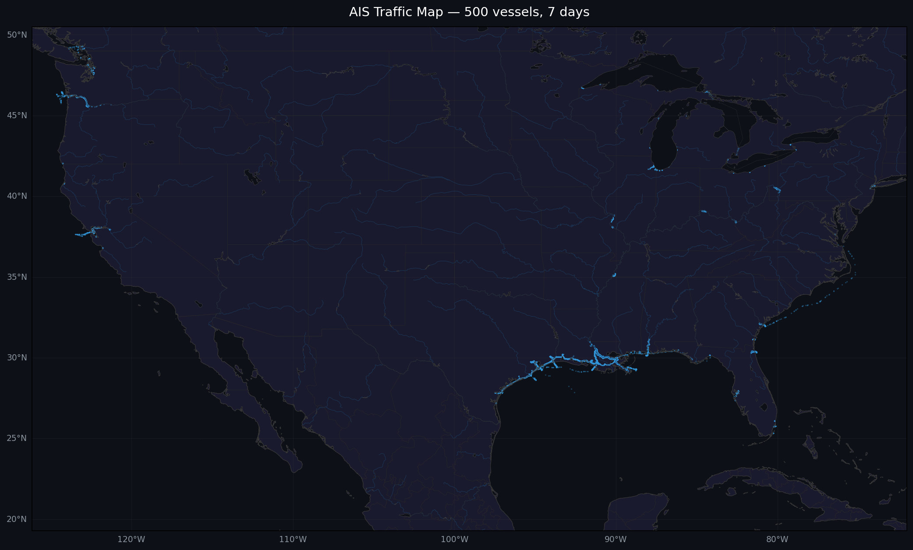

2022년 1월 7일간 미국 연안에서 AIS 신호를 보낸 선박 500척의 위치입니다. 동해안, 서해안, 멕시코만 연안을 따라 항적이 분포하고, 주요 항구 근처에 밀집되어 있는 게 보입니다.

### 1. 어떤 배들이 있나

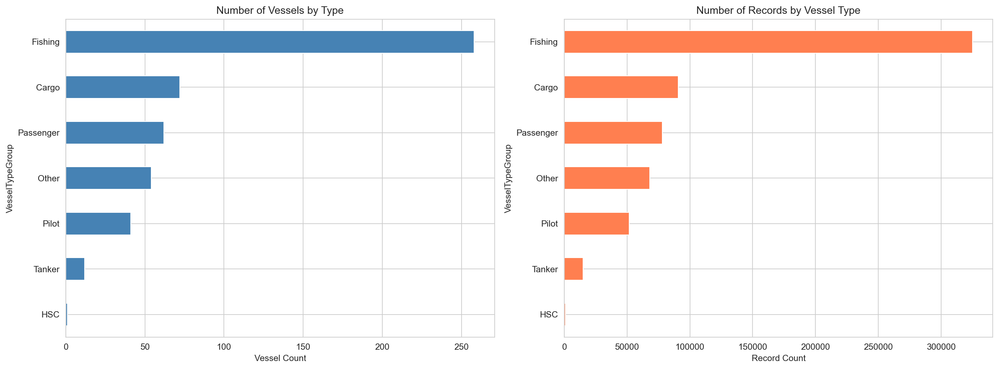

500척 중 절반 이상이 어선(Fishing)입니다. 미국 연안 데이터라 어선 비중이 높고, 화물선(Cargo)과 여객선(Passenger)이 뒤를 잇습니다. 어선이 많다는 건 이상 탐지 관점에서 좋은 소식인데, 실제로 불법조업 같은 이상 행동이 가장 빈번한 선종이 어선이기 때문입니다.

### 2. 속도 분포

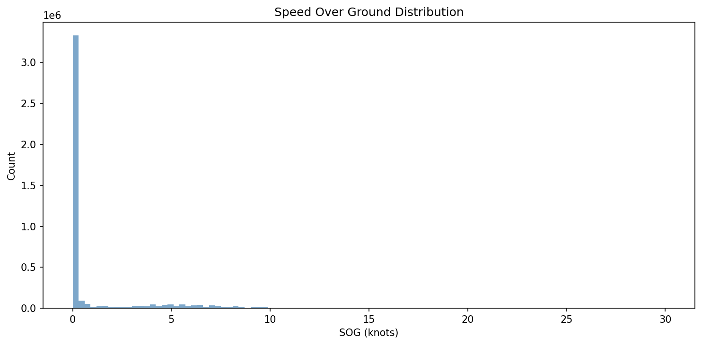

대부분의 선박이 0~5노트(정박 또는 저속)에 몰려 있습니다. 선종별 평균 속도 차이가 확연한데, HSC(고속선)가 가장 빠르고 어선이 느린 편입니다. 이 차이가 이상 탐지에서 중요합니다 — 어선이 갑자기 고속으로 달리면 의심할 만하니까요.

### 3. 이상 탐지용 피처 분포

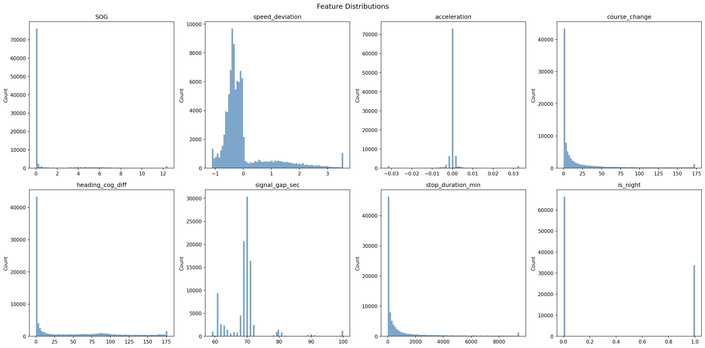

7가지 피처를 만들었습니다.
- **Speed Deviation**: 해당 선박의 평균 속도 대비 얼마나 벗어났는지. 대부분 0 근처에 몰려 있고 양 끝단이 이상 후보입니다.
- **Acceleration**: 속도 변화율. 급가속/급감속 구간을 잡아냅니다.
- **Course Change**: 연속 레코드 간 침로 변화량(도). 30도 이상이면 꽤 급격한 방향 전환입니다.
- **Heading-COG Diff**: 선수방향과 대지침로의 괴리. 45도 이상이면 조류/바람 영향 또는 비정상 상태를 의심합니다.
- **Signal Gap**: AIS 신호 간 시간 간격(분). 30분 이상 끊기면 의도적 신호 차단을 의심할 수 있습니다.
- **Stop Duration**: 정박/저속 지속 시간. 특이한 장소에서 장시간 정박하면 의심 대상입니다.
- **Night Activity**: 선박별 야간(22시~06시) 활동 비율.

### 4. IF 자동 임계값 결정

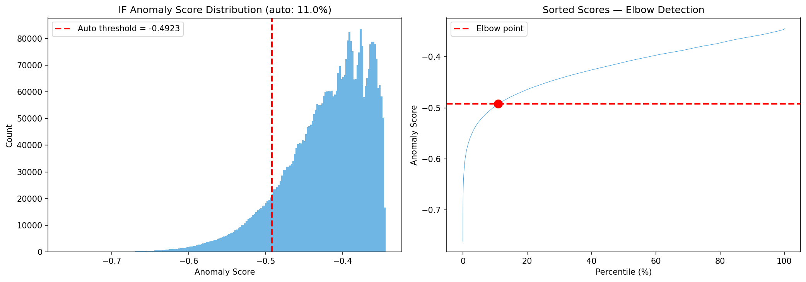

Isolation Forest의 anomaly score 분포에서 elbow point를 자동으로 찾습니다. 왼쪽은 score 히스토그램과 자동 결정된 임계값(-0.4891), 오른쪽은 정렬된 score 곡선에서 elbow가 잡히는 지점입니다. 사전에 "5%를 이상으로 잡아라"고 지정하지 않고 **모델이 스스로 11.5%를 도출**했습니다.

### 5. 모델 비교

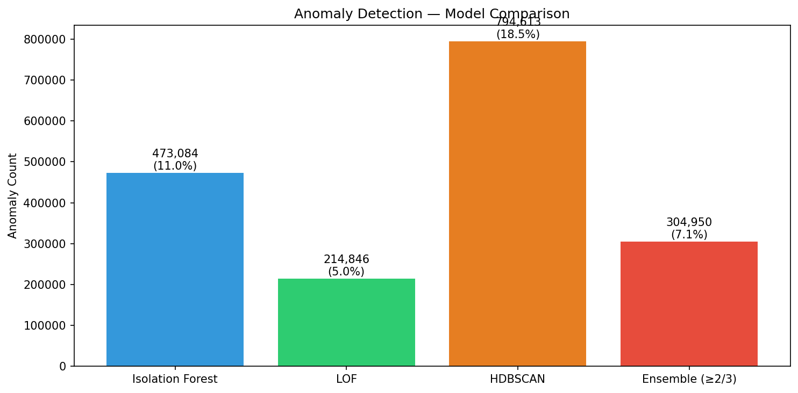

| 모델 | 이상 탐지 수 | 비율 | 방식 |
|------|-------------|------|------|
| Isolation Forest | 473,084 | 11.02% | 글로벌, 자동 임계값 |
| LOF | 214,846 | 5.00% | 선박별 |
| HDBSCAN | 794,613 | 18.51% | 선박별 |
| **앙상블 (2/3 동의)** | **304,950** | **7.10%** | — |

IF가 자동 임계값으로 11.0%를 잡으면서, 앙상블 결과도 7.10%로 올라갔습니다. 기존 5% 강제 설정 대비 더 많은 이상을 포착하되, 앙상블에서 단일 모델 판단은 걸러내므로 false positive를 억제합니다.

### 5-1. 모델 간 겹침 분석

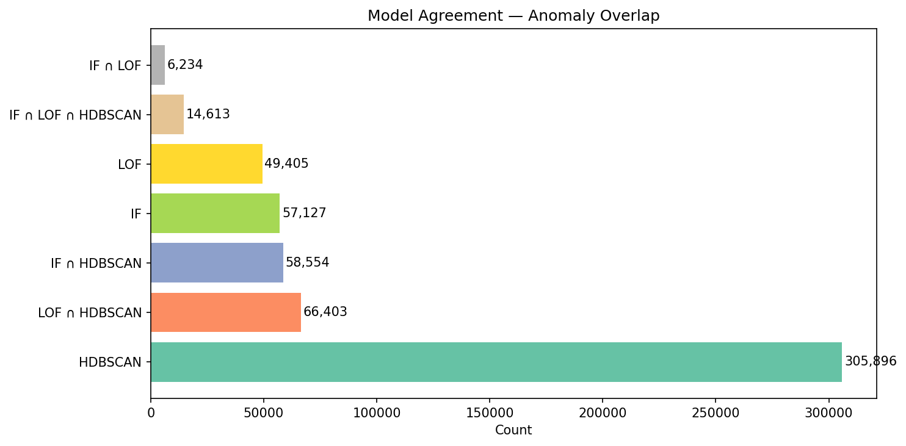

3개 모델이 어떻게 겹치는지 분석했습니다. 각 모델이 다른 관점(글로벌 vs 선박별, 밀도 vs 격리)으로 접근하기 때문에 겹침 패턴이 모델의 특성을 반영합니다.

### 5-2. contamination 민감도 분석

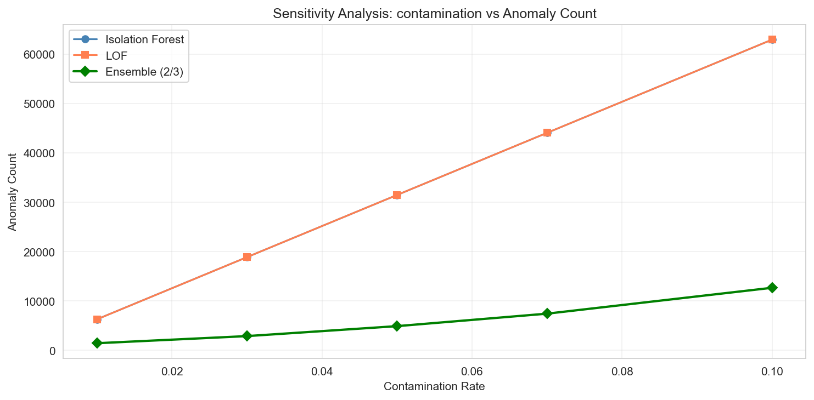

contamination(오염 비율)을 1%~10%로 바꿔보면서 결과가 얼마나 달라지는지 확인했습니다. HDBSCAN은 contamination 파라미터가 없으므로 고정값이며, 앙상블에서 IF/LOF의 변화에 따라 최종 결과가 조절됩니다.

### 6. 정상 vs 이상 — 뭐가 다른가

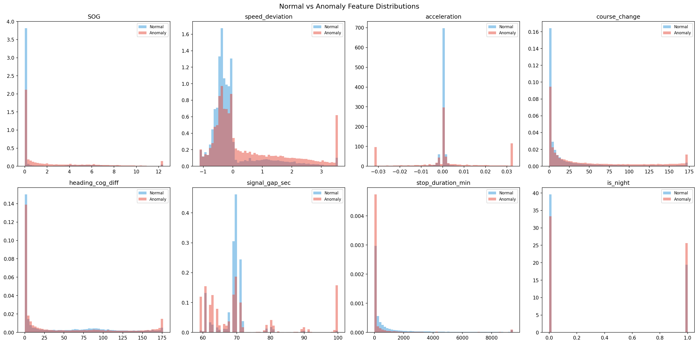

이상으로 판정된 레코드(빨강)가 정상(파랑)과 어떻게 다른지 7가지 피처 차원에서 비교합니다.
- **SOG**: 이상 레코드는 고속 구간에 뚜렷하게 몰려 있습니다.
- **Acceleration**: 급가속/급감속 구간에서 이상이 집중됩니다.
- **Course Change**: 160~180도 급회전(유턴 수준)에서 이상이 튑니다.
- **Heading-COG Diff**: 선수방향과 진행방향의 큰 괴리가 이상 레코드에서 두드러집니다.

### 7. SHAP 기반 피처 기여도 분석

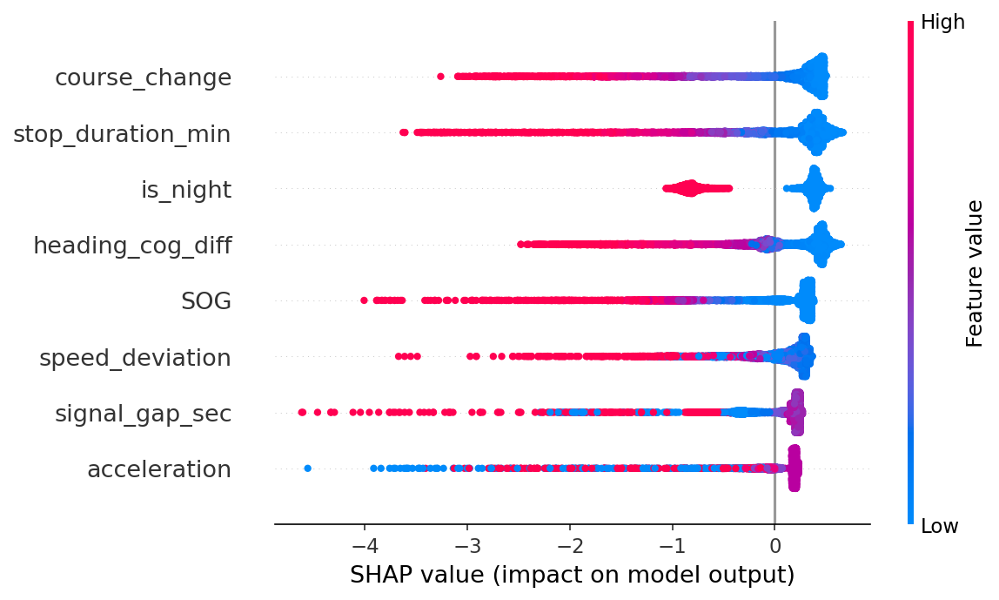

SHAP으로 Isolation Forest의 이상 판정 근거를 분석했습니다. 각 점은 하나의 레코드이고, 색상은 피처 값의 크기(빨강=높음, 파랑=낮음)를 나타냅니다. course_change와 stop_duration_min이 이상 판정에 가장 큰 영향을 미칩니다.

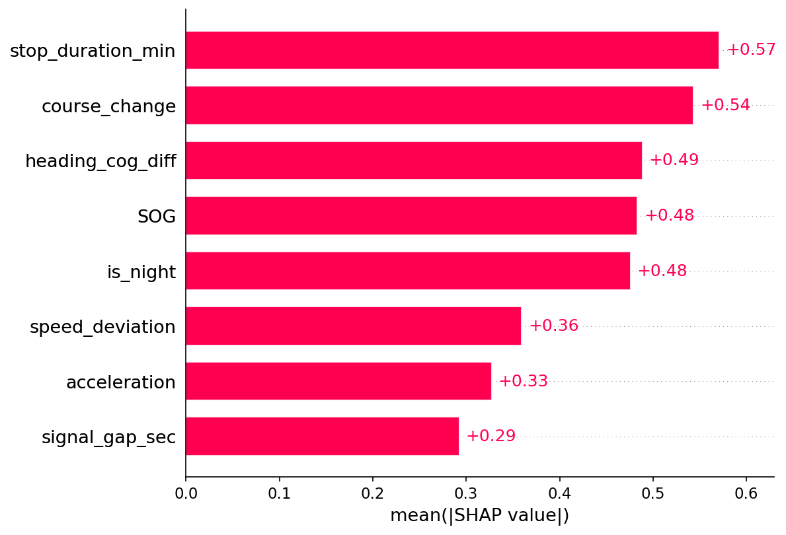

평균 |SHAP| 기준 피처 중요도 순위입니다. 어떤 피처가 이상 판정에 가장 큰 영향을 미치는지 한눈에 볼 수 있습니다.

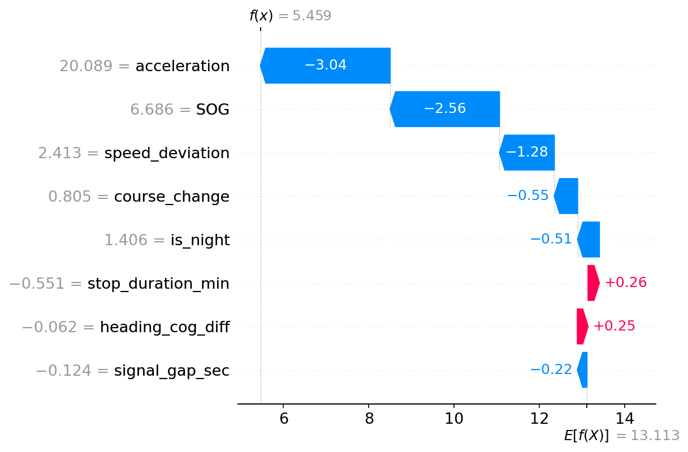

개별 이상 레코드에 대한 waterfall plot입니다. **"이 배가 왜 이상한지"** 를 피처별로 분해해서 보여줍니다. 예를 들어 "이 레코드는 course_change가 높아서 이상 점수의 30%를 차지했고, SOG도 높아서 25%를 기여했다"는 식으로 해석할 수 있습니다.

### 8. 도메인 기반 교차 검증

라벨이 없는 비지도 학습이라 정확도 측정이 어렵습니다. 대신 **해양 도메인에서 알려진 이상 패턴 6가지**를 정의하고, 모델이 이 패턴을 얼마나 잡아내는지 검증했습니다.

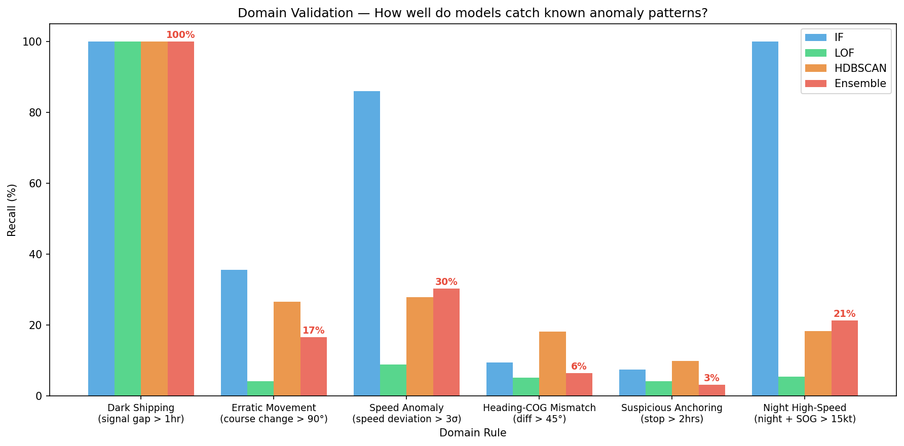

| 도메인 규칙 | 해당 건수 | 앙상블 탐지율 | 해석 |
|-------------|----------|-------------|------|
| Dark Shipping (신호 단절 > 1시간) | 461 | **100%** | AIS를 끄는 은닉 행동을 완벽히 포착 |
| Speed Anomaly (속도 편차 > 3σ) | 76,249 | **29.4%** | 급가속/급감속의 약 1/3을 탐지 |
| Night High-Speed (야간 + 15노트 이상) | 8,092 | **21.5%** | 야간 고속 운항을 선별적으로 포착 |
| Erratic Movement (침로 변화 > 90°) | 444,010 | **16.7%** | 급격한 방향 전환 중 이상적인 건만 포착 |
| Heading-COG Mismatch (괴리 > 45°) | 1,568,460 | 6.9% | 대부분 정상적 조류/바람 영향이라 낮은 탐지율이 적절 |
| Suspicious Anchoring (정박 > 2시간) | 2,297,602 | 3.4% | 대부분 정상 정박이라 낮은 탐지율이 적절 |

**핵심 발견**: Dark Shipping(AIS 끄기)을 100% 탐지하고, Speed Anomaly 29%, Night High-Speed 22%를 포착합니다. Heading-COG Mismatch와 Suspicious Anchoring의 낮은 탐지율은 **정상적인 결과**입니다 — 선수-침로 괴리의 대부분은 자연적인 조류/바람 영향이고, 2시간 이상 정박도 대부분 정상 항구 정박이기 때문입니다. heading_cog_diff NaN을 0으로 대체한 이후 Mismatch 해당 건수가 310만 → 157만으로 절반 감소하여, 실제 괴리가 있는 데이터만 남게 되었습니다.

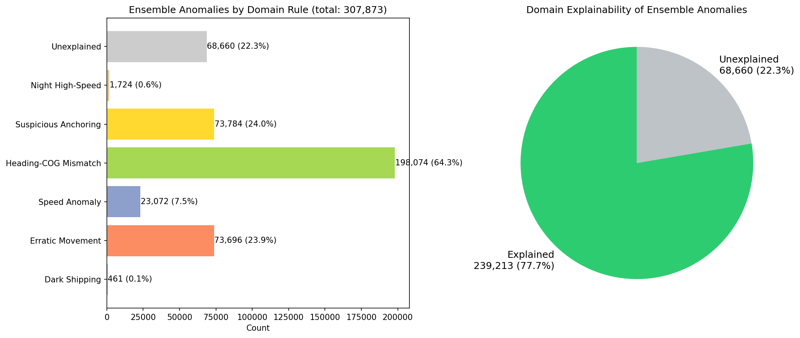

앙상블이 탐지한 304,950건의 이상 중 **도메인 규칙으로 설명 가능한 비율**과 규칙에 해당하지 않는 새로운 패턴이 함께 존재합니다. 비지도 학습이 기존 규칙으로는 잡지 못하는 이상까지 발견하고 있다는 의미입니다.

### 9. 이상 항적 지도

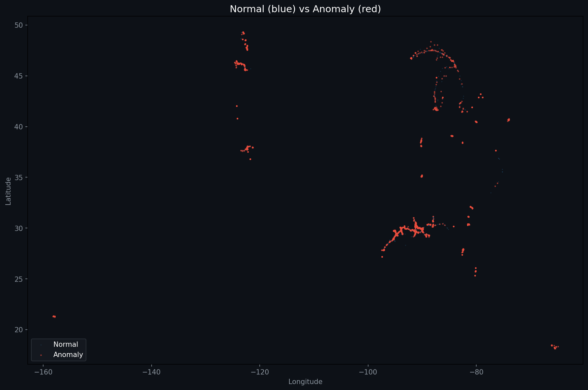

정상 항적(파랑)과 이상 항적(빨강)을 찍었습니다. 이상이 연안 전체에 분포하지만, 특히 항구 입출항 구간과 항로 전환 지점에 집중되는 게 보입니다.

### 10. 이상 상위 3척 항적 추적

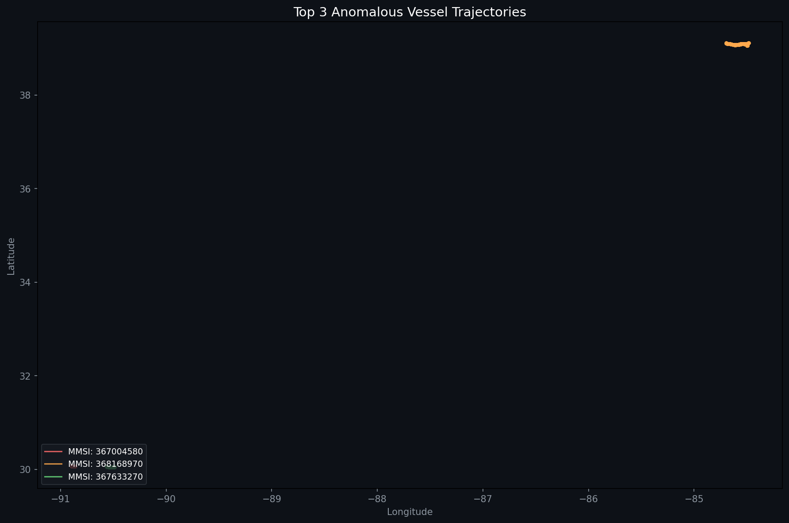

이상 레코드가 가장 많은 선박 3척의 항적을 추적했습니다. 장거리 이동하면서 이상 구간(점)이 반복적으로 나타나는 패턴이 보입니다. 이런 선박은 실제로 정밀 조사 대상이 될 수 있습니다.

### 11. 이상 1위 선박 딥다이브

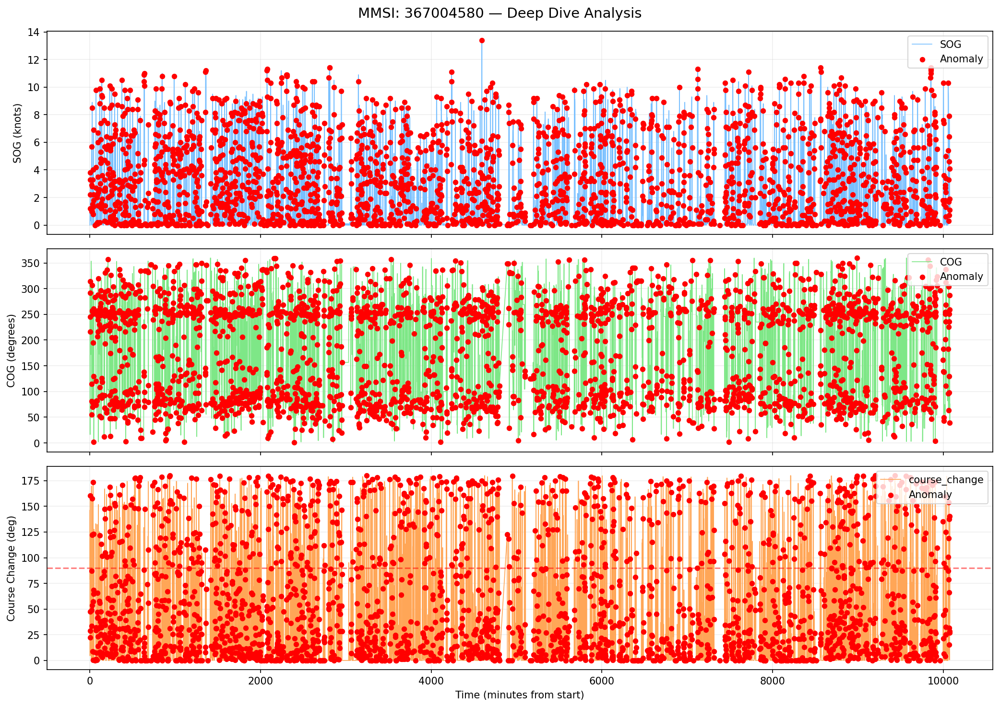

이상 레코드가 가장 많은 선박(MMSI: 367004580, 총 8,963건 중 2,679건 이상) 한 척을 7일간 추적한 시계열입니다. 위에서부터 SOG(속도), COG(침로), Course Change(침로 변화량)입니다. 빨간 점이 이상으로 탐지된 시점인데, 급격한 속도/침로 변화 구간에서 이상이 집중됩니다.

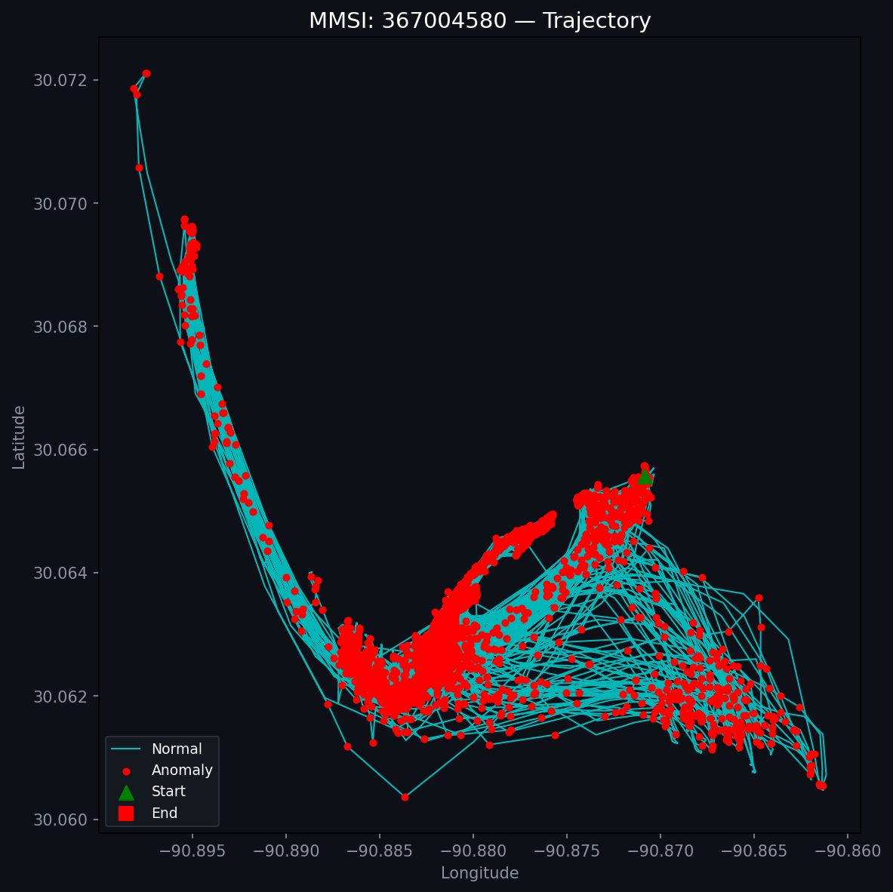

같은 선박의 항적을 지도에 찍으면 이렇게 됩니다. 초록 삼각형이 출발, 빨간 사각형이 도착. 빨간 점이 이상 구간인데, 항로 전환 지점에 몰려 있습니다.

### 12. 시간대별 이상 빈도

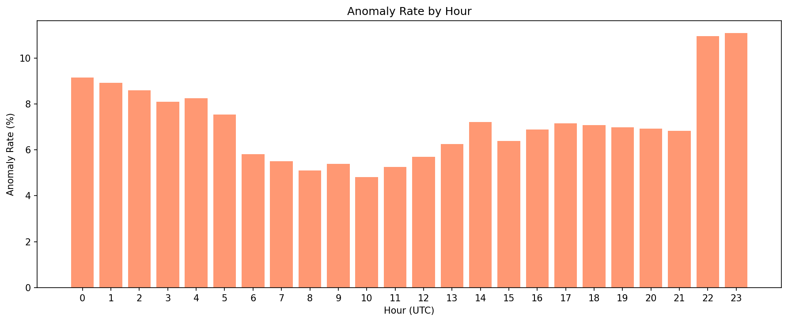

UTC 기준 시간대별 이상 발생률입니다. 야간(22~23시 UTC)에 이상 비율이 가장 높고, 오전(10시)에 가장 낮습니다. 야간에 이상 행동이 집중되는 패턴은 불법 활동과 관련될 수 있습니다.

### 13. 선박 유형별 이상 비율

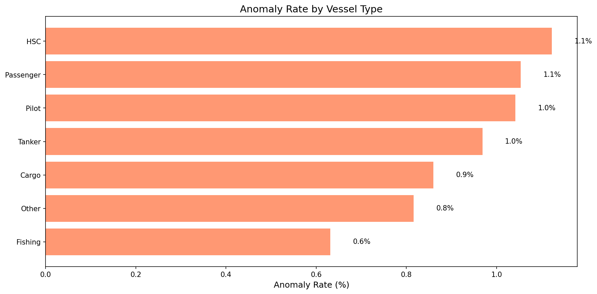

선종별 이상 비율입니다. 여객선이 높은 건 운항 특성상 항구 입출항 시 급가속/급감속이 잦기 때문으로 보입니다. 탱커는 대형 선박 특성상 안정적인 항행 패턴을 보여 이상 비율이 낮습니다.

---

## Conclusion

### 핵심 발견

7일간 AIS 레코드(430만 행, 500척)에서 3개 모델 앙상블로 304,950건(7.10%)의 이상 행동을 탐지했습니다. IF의 자동 임계값(elbow method)으로 이상 비율을 모델이 스스로 결정하게 하고, 도메인 규칙 교차 검증으로 탐지 결과가 해양 도메인에서 설명 가능함을 확인했습니다. GPS 텔레포테이션(220건) 사전 필터링과 heading_cog_diff NaN 대체 전략 개선으로 데이터 품질도 확보했습니다.

SHAP 분석 결과 이상 판정에 가장 크게 기여하는 피처는 **침로 변화(course_change)**와 **정박 패턴(stop_duration_min)**, 그리고 **속도(SOG)**였습니다.

### 실용적 의미

이 시스템의 핵심은 **스크리닝**입니다. 대량의 AIS 레코드에서 감시 대상을 좁혀주고, SHAP으로 **"왜 이상한지"**까지 설명할 수 있으니 해양 감시 인력이 단순 목록이 아닌 **근거 기반 우선순위**로 판단할 수 있습니다. 특히 Dark Shipping(AIS 끄기) 100% 탐지는 실무에서 즉시 활용 가능한 수준입니다.

### 한국 해역 적용 시

현재는 미국 연안 데이터로 방법론을 검증한 단계입니다.

- **불법조업 탐지**: 한국 EEZ 내 중국 어선의 불법조업이 실제 이슈인 만큼, 어선의 이상 비율이 크게 달라질 수 있음
- **신호 단절 패턴**: 불법 선박은 단속 회피를 위해 AIS를 의도적으로 끄는 경우가 많아 핵심 피처가 될 수 있음
- **야간 집중 패턴**: 단일 시간대인 한국 해역에서는 야간 이상 집중이 더 뚜렷하게 나올 것으로 보임

---

## 한계점 및 향후 계획

- 현재는 미국 연안 데이터를 썼지만, 최종 목표는 **한국 해역(해양수산부 공공데이터)** 적용입니다
- 상위 500척만 추출했기 때문에 신호 단절 패턴이 잡히지 않을 수 있습니다. 전체 선박 대상 분석이 필요합니다
- 라벨이 없는 비지도 학습이라 정확도 측정이 어렵습니다. 실제 불법조업 적발 데이터와 매칭하면 검증이 가능합니다
- 7일 데이터로는 주간/월간 행동 패턴을 파악하기 어렵습니다. 1개월 이상으로 확장하면 분석 깊이가 개선됩니다

## Getting Started

```bash
git clone https://github.com/yangbeomseok/ais-anomaly-detection.git
cd ais-anomaly-detection
pip install -r requirements.txt

# AIS 데이터 다운로드 (~5GB)
python scripts/download_ais.py

# 전체 파이프라인 실행
python scripts/build_pipeline.py

# 또는 모델만 실행 (피처 생성 완료 후)
python scripts/run_models.py

# 시각화 생성
python scripts/run_visualization.py

# 도메인 검증
python scripts/run_validation.py

# 노트북 실행
jupyter notebook
```

노트북을 01번부터 순서대로 실행하면 됩니다.

## License

MIT
