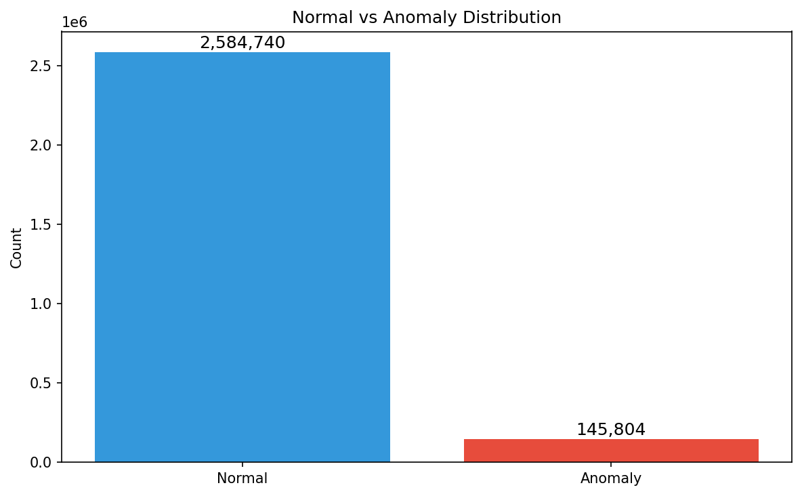
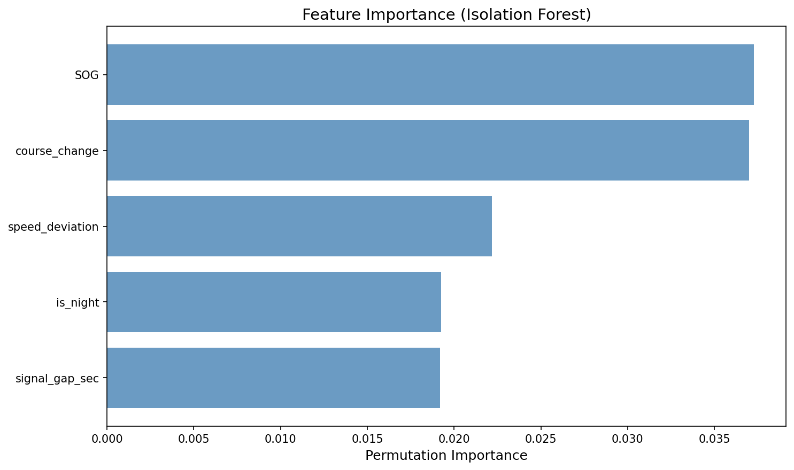
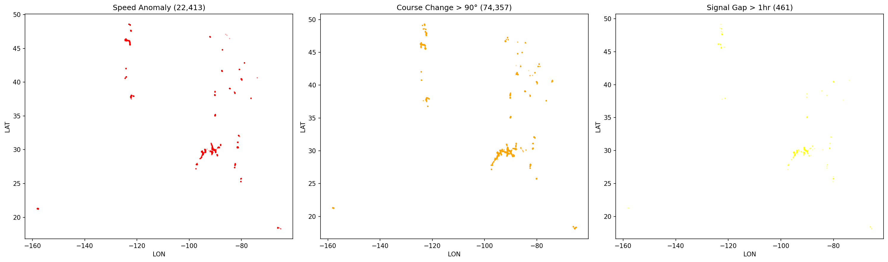

# AIS 선박 항적 이상 탐지 시스템

Maritime Vessel Anomaly Detection using AIS Data

## Overview

해양빅데이터AI센터에서 연구선 관측자료 다루며... AIS 데이터도 비슷한 방식으로 분석해볼 수 있겠다 싶어서 시작한 사이드 프로젝트입니다.

해양에서 선박이 AIS 신호를 통해 위치/속도/침로를 주기적으로 송신하는데, 이걸 역으로 활용하면 **"이 배 뭔가 이상한데?"** 를 데이터로 잡아낼 수 있지 않을까? 라는 생각이 출발점이었습니다.

실제로 불법조업 선박은 단속 해역에서 급격한 방향 전환을 하거나, AIS 신호를 꺼버리는 패턴을 보입니다. 이런 행동 패턴을 비지도 학습으로 탐지하는 게 프로젝트의 핵심

## 뭘 했나

- NOAA에서 미국 연안 AIS 데이터 하루치(720만 건)를 가져와서
- 활동량 상위 500척(63만 건)으로 추려서
- 속도 이상, 급회전, 신호 단절 같은 피처를 만들고
- Isolation Forest / LOF / DBSCAN 세 가지 모델로 이상 탐지 돌려서
- 3개 중 2개 이상이 "이상"이라고 판단한 건만 최종 이상으로 잡았습니다

## Tech Stack


## Project Structure

```
ais-anomaly-detection/
├── notebooks/
│   ├── 01_data_collection.ipynb      # 데이터 수집 및 전처리
│   ├── 02_eda.ipynb                  # 탐색적 데이터 분석
│   ├── 03_feature_engineering.ipynb  # 피처 엔지니어링
│   ├── 04_anomaly_detection.ipynb    # 이상 탐지 모델링
│   └── 05_visualization.ipynb        # 지도 기반 시각화
├── src/
│   ├── data_loader.py
│   ├── preprocessing.py
│   ├── features.py
│   ├── models.py
│   └── visualize.py
├── data/
│   └── raw/                          # 원본 데이터 (git 미추적)
├── results/
│   └── figures/
├── requirements.txt
└── README.md
```

## Data

| 데이터 | 출처 | 비고 |
|--------|------|------|
| NOAA AIS (2022-01-01) | [MarineCadastre](https://marinecadastre.gov/accessais/) | 미국 연안, 하루치 720만 건 |

원본 CSV는 744MB라 git에 올리지 않았습니다. 노트북 01번에서 다운로드 및 전처리 과정을 확인할 수 있습니다.

## Analysis Pipeline

```
원본 720만 건 → 전처리 → 상위 500척 63만 건 → 피처 생성 → 모델 3종 → 앙상블 → 최종 4,907건 이상 (0.78%)
```

---

## Results

### 0. 선박 교통량 지도


2022년 1월 1일 하루 동안 미국 연안에서 AIS 신호를 보낸 선박 500척의 위치입니다. 동해안, 서해안, 멕시코만 연안을 따라 항적이 분포하고, 주요 항구 근처에 밀집되어 있는 게 보입니다.

### 1. 어떤 배들이 있나


500척 중 절반 이상이 어선(Fishing)입니다. 미국 연안 데이터라 어선 비중이 높고, 화물선(Cargo)과 여객선(Passenger)이 뒤를 잇습니다. 어선이 많다는 건 이상 탐지 관점에서 좋은 소식인데, 실제로 불법조업 같은 이상 행동이 가장 빈번한 선종이 어선이기 때문입니다.

### 2. 속도 분포


대부분의 선박이 0~5노트(정박 또는 저속)에 몰려 있습니다. 왼쪽 그래프에서 median이 0에 가까운 건, 정박 중인 선박의 AIS 신호가 포함되어 있기 때문입니다. 오른쪽을 보면 선종별 평균 속도 차이가 확연한데, HSC(고속선)가 가장 빠르고 어선이 느린 편입니다. 이 차이가 이상 탐지에서 중요합니다 — 어선이 갑자기 고속으로 달리면 의심할 만하니까요.

### 3. 이상 탐지용 피처 분포


4가지 피처를 만들었습니다.
- **Speed Deviation**: 해당 선박의 평균 속도 대비 얼마나 벗어났는지. 대부분 0 근처에 몰려 있고 양 끝단이 이상 후보입니다.
- **Course Change**: 연속 레코드 간 침로 변화량(도). 30도 이상이면 꽤 급격한 방향 전환입니다.
- **Signal Gap**: AIS 신호 간 시간 간격(분). 보통 1분 내외인데, 30분 이상 끊기면 의도적 신호 차단을 의심할 수 있습니다.
- **Night Activity**: 선박별 야간(22시~06시) 활동 비율. 야간에만 움직이는 선박은 주의 대상입니다.

### 4. 모델 비교


3가지 모델을 돌렸는데, Isolation Forest와 LOF는 각각 31,477건(5%)으로 거의 같은 수를 잡았고, DBSCAN은 3,804건으로 적습니다. DBSCAN이 적은 건 메모리 한계로 3만 건 샘플링 후 돌렸기 때문입니다.

오른쪽 Model Agreement를 보면 대부분이 0(정상)이고, 2개 이상 모델이 동의한 건이 최종 이상으로 잡힙니다. 단일 모델만 이상이라고 한 건은 false positive일 가능성이 높아서 걸러냈습니다.

### 5. 정상 vs 이상 — 뭐가 다른가


이상으로 판정된 레코드(빨강)가 정상(파랑)과 어떻게 다른지 보여줍니다.
- **SOG**: 이상 레코드는 고속 구간(15~20kn)에 뚜렷하게 몰려 있습니다. 평소 느린 배가 갑자기 빨라진 경우입니다.
- **Speed Deviation**: 양 극단(특히 +2 이상)에 이상이 집중됩니다.
- **Course Change**: 160~180도 급회전에서 이상이 튑니다. 거의 유턴 수준의 방향 전환입니다.
- **Signal Gap**: 이상 레코드가 80초 이상 구간에 많습니다. 정상은 대부분 60~70초 간격으로 균일합니다.

### 6. 이상 항적 지도


실제 지도 위에 정상 항적(파랑)과 이상 항적(빨강)을 찍었습니다. 이상이 연안 전체에 분포하지만, 특히 항구 입출항 구간과 항로 전환 지점에 집중되는 게 보입니다.

### 7. 이상 상위 3척 항적 추적


이상 레코드가 가장 많은 선박 3척의 항적을 추적했습니다. 서해안에서 장거리 이동하면서 이상 구간(점)이 반복적으로 나타나는 패턴이 보입니다. 이런 선박은 실제로 정밀 조사 대상이 될 수 있습니다.

### 8. 최종 이상 탐지 결과



63만 건 중 **4,907건(0.78%)** 이 최종 이상으로 판정됐습니다. 500척 중 479척에서 1건 이상의 이상이 감지됐는데, 이건 "이상한 배"가 아니라 "이상한 순간"을 잡은 것이기 때문에 자연스러운 결과입니다. 정상적인 선박도 항구 입출항 시 급회전하거나 일시적으로 속도가 튀는 경우가 있으니까요.

### 9. 시간대별 이상 빈도


UTC 기준 시간대별 이상 발생률입니다. 특정 시간대에 편중되지 않고 비교적 고르게 분포하는데, 미국 연안 데이터라 시차가 다양한 지역이 섞여 있어서 그런 것으로 보입니다. 한국 해역 데이터로 분석하면 야간 집중 패턴이 더 뚜렷하게 나올 수 있습니다.

### 10. 선박 유형별 이상 비율


HSC(고속선)가 1.1%로 가장 높고, 어선이 0.6%로 가장 낮습니다. 의외로 어선이 낮은데, 이건 미국 연안 데이터라 한국처럼 불법조업 이슈가 반영되지 않아서입니다. 고속선과 여객선이 높은 건 운항 특성상 급가속/급감속이 잦기 때문으로 보입니다.

### 11. 피처 중요도



Isolation Forest에서 Permutation Importance를 뽑아봤습니다. **SOG(속도)**와 **course_change(침로 변화)**가 이상 판단에 가장 큰 영향을 줬습니다. 직관적으로도 맞는 결과인데, "갑자기 빨라지거나 급회전하는 배"가 가장 의심스러운 거니까요. signal_gap_sec과 is_night은 상대적으로 낮은데, 앞서 봤듯이 상위 500척에서는 신호 단절이 거의 없었기 때문입니다.

### 12. 이상 1위 선박 딥다이브 (MMSI: 416497000)


이상 레코드가 가장 많은 선박 한 척을 24시간 추적한 시계열입니다. 위에서부터 SOG(속도), COG(침로), Course Change(침로 변화량)입니다. 빨간 점이 이상으로 탐지된 시점인데, 초반 가속 구간(0~200분)에 이상이 집중되어 있습니다. 출항 직후 14노트에서 20노트까지 급가속하면서 침로도 270도에서 300도로 전환하는 구간입니다.


같은 선박의 항적을 지도에 찍으면 이렇게 됩니다. 초록 삼각형이 출발, 빨간 사각형이 도착. 빨간 점이 이상 구간인데, 출발 직후와 중간 항로 전환 지점에 몰려 있습니다.

### 13. 이상 유형별 공간 분포



이상을 유형별로 나눠서 지도에 찍었습니다.
- **Speed Anomaly (1,554건)**: 미국 서해안과 동해안 연안에 골고루 분포합니다.
- **Course Change > 90도 (1,422건)**: 항구 근처에 집중됩니다. 입출항 시 급회전이 많기 때문입니다.
- **Signal Gap > 1hr (0건)**: 상위 500척은 활동량이 많은 선박이라 장시간 신호 단절이 없었습니다. 실제 불법조업 선박은 활동량 자체가 적을 수 있어서, 전체 데이터 분석 시에는 다른 결과가 나올 것으로 예상됩니다.

---

## 한계점 및 향후 계획

- 현재는 미국 연안 데이터를 썼지만, 최종 목표는 **한국 해역(해양수산부 공공데이터)** 적용입니다
- 상위 500척만 추출했기 때문에 신호 단절 패턴이 잡히지 않았습니다. 전체 선박 대상 분석이 필요합니다
- DBSCAN은 메모리 한계로 샘플링했는데, 향후 Mini-Batch 방식이나 HDBSCAN으로 개선할 수 있습니다
- 라벨이 없는 비지도 학습이라 정확도 측정이 어렵습니다. 실제 불법조업 적발 데이터와 매칭하면 검증이 가능합니다

## Getting Started

```bash
git clone https://github.com/yangbeomseok/ais-anomaly-detection.git
cd ais-anomaly-detection
pip install -r requirements.txt
jupyter notebook
```

노트북을 01번부터 순서대로 실행하면 됩니다. 원본 데이터는 01번 노트북에서 NOAA 사이트에서 다운로드할 수 있습니다.

## License

MIT
